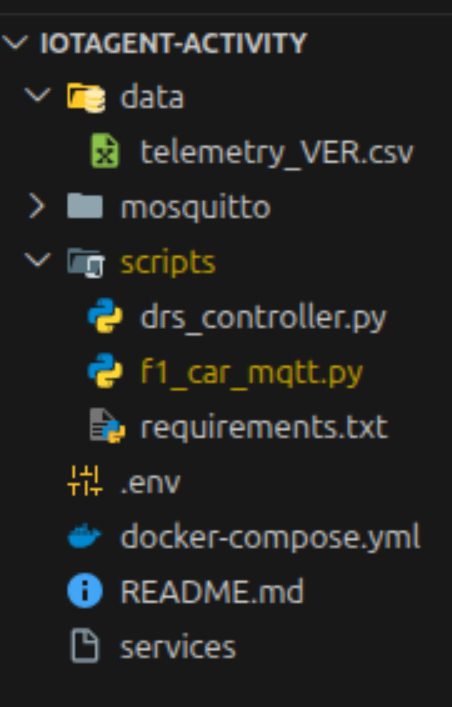

## Introducción

En esta actividad nos familiarizaremos con el uso de _IoT Agents_ en FIWARE. En concreto, usaremos un IoT Agent que permita a dispositivos comunicarse con Fiware usando el protocolo de transporte MQTT y el formato de datos UltraLight 2.0.

## Descripción de la actividad

En esta actividad, simularemos el envío de datos de un coche de F1 durante un gran premio usando los protocolos MQTT y UltraLight 2.0 a una plataforma FIWARE. A ésta se subscribirá una aplicación que determinará automáticamente cuando activar el DRS (Drag Reduction System) del vehículo en función de la velocidad del coche y del estado del pedal de freno y acelerador.

### Entidad Coche F1

La entidad que representará al coche de F1 en el Context Broker tendrá la misma estructura que se utilizó en la actividad **(ACT-Fi-1) Especificación de entidades en NGSI-v2 - NO EVALUABLE**. Pero sin incluir los atributos `oilTemp` y `position`. Además, se añadirá un nuevo atributo de tipo comando llamado `drs`, que tomará los valores `ON` y `OFF`, en función de si se activa o desactiva el DRS del coche.
De esta forma un resumen de un coche de F1 tendría la siguiente estructura:

- _brake (b)_: Indica si se pisa el freno o no (0,1)
- _throttle (t)_: Indica la presión en el pedal de acelerador en porcentaje (0-100%).
- _speed (s)_: Velocidad del coche en km/h.
- _gear (g)_: Marcha en la que se encuentra el coche (0,1-8). O indica punto muerto.
- _rpm (r)_: Revoluciones por minuto del motor.
- _drs_: Comando para activar o desactivar el DRS (ON, OFF).
- _team_: Referencia a la entidad equipo, luego es un atributo de tipo "Relationship".
- _driver_: Referencia a la entidad piloto, luego es un atributo de tipo "Relationship".

Un ejemplo de **`team`** y **`driver`** se proporciona en la solución de la actividad **(ACT-Fi-1) Especificación de entidades en NGSI-v2 - NO EVALUABLE**, y se muestra a continuación para mayor comodidad. Para un **`team`**:

```json
{
  "id": "Team:RedBullRacing",
  "type": "Team",
  "name": {
    "type": "Text",
    "value": "Red Bull Racing"
  },
  "acronym": {
    "type": "Text",
    "value": "RBR"
  },
  "color": {
    "type": "Text",
    "value": "#1e41ff"
  },
  "country": {
    "type": "Text",
    "value": "Austria"
  }
}
```

para un **`driver`**:

```json
{
  "id": "Driver:VER",
  "type": "Driver",
  "firstName": {
    "type": "Text",
    "value": "Max"
  },
  "lastName": {
    "type": "Text",
    "value": "Verstappen"
  },
  "acronym": {
    "type": "Text",
    "value": "VER"
  },
  "number": {
    "type": "Number",
    "value": 1
  },
  "countryCode": {
    "type": "Text",
    "value": "NLD"
  }
}
```

## Acciones a realizar

### 1.- Implementar la comunicación MQTT en coche F1

- Se debe **implementar el envío de datos** desde el coche de F1 usando el protocolo MQTT y el formato UltraLight 2.0 en el **script de python** proporcionado **(`f1_car_mqtt.py`)**. Para ello, se debe usar la librería **`paho-mqtt`** de python, y cumplimentar las acciones indicadas en los **`#TODO`** del script.
- En ese mismo script también se debe implementar la lógica para **responder a los comandos** de activación y desactivación del DRS enviados desde FIWARE a través del IoT Agent MQTT-UltraLight.

### 2.- Configurar el IoT Agent MQTT-UltraLight

- Se debe dar de alta a las entidades, servicios y dispositivos necesarios en Orion y el IoT Agent, para que se pueda realizar la comunicación entre el coche de F1 y FIWARE.

### 3.- Implementar la aplicación de activación del DRS

- El script **`drs_controller.py`** se deberá suscribir a los cambios de la entidad coche de F1 en Orion, y en él se implementará siguiendo las acciones indicadas en los **`#TODO`** que:
  - **Active el DRS**, cambiando el estado del atributo en Orion, activando el DRS cuando la velocidad del coche sea igual o superior a 200 km/h, y no se esté pisando el freno (brake = 0).
  - **Desactive el DRS** en caso contrario de que la velocidad sea menor a 200 km/h o los frenos estén siendo pisados (brake = 1).

## Materiales proporcionados

Se proporciona un repositorio de GitHub con los scripts base para la actividad. Para descargarlo, ejecutar los siguientes comandos en una terminal:

```bash
git clone https://github.com/franciscodelicado/IoTAgent-Activity.git
cd IoTAgent-Activity
```

En este directorio hay el siguiente contenido:

<figure>
   
</figure>

donde:

- _.env_: es el fichero de variables de entorno para lanzar los contenedores de Docker.
- _docker-compose.yml_: es el fichero de especificación de los contenedores de Docker a lanzar en el ejercicios.
- _README.md_: es el fichero que se está leyendo, con las instrucciones para realizar la actividad.
- _services_: es un script para lanzar y detener los contenedores de Docker.
- _scripts/_: es la carpeta que contiene los scripts de python para la actividad, y el fichero de dependencias `requirements.txt`.
- _data/telemetry_VER.csv_: es un fichero con datos de telemetría real del piloto Max Verstappen en el gran premio de Mónaco de 2021. Este fichero se puede usar para simular el envío de datos reales del coche de F1 a FIWARE.

### Instalación de dependencias Python

Los script de python se encuentran en la carpeta `scripts/`. Y se recomienda el crear un entorno virtual de python para instalar las dependencias necesarias que están indicadas en el fichero `scripts/requirements.txt`. Para ambas cosas, se pueden ejecutar los siguientes comandos:

```bash
cd scripts

#
#Creo entorno virtual
#
python3 -m venv .venv
source .venv/bin/activate

#
#Instalo dependencias
#
pip install -r requirements.txt
```

### Ejecución de los contenedores FIWARE

Para ejecutar los contenedores de FIWARE necesarios para la actividad, se proporciona un script `services` en la raíz del repositorio. Para iniciar los contenedores, ejecutar el siguiente comando en una terminal:

```bash
./services start
```

Para detener los contenedores, ejecutar el siguiente comando en una terminal:

```bash
./services stop
```

## Instrucciones para la entrega

Se ha de entregar lo siguiente:

- El script **`f1_car_mqtt.py`** con la implementación del envío de datos vía MQTT y la respuesta a los comandos de activación/desactivación del DRS.
- El script **`drs_controller.py`** con la implementación de la lógica de activación/desactivación del DRS.
- El fichero **`requirements.txt`** con las dependencias necesarias para ejecutar los scripts de python (por si se han añadido nuevas dependencias).
- Un fichero con las peticiones HTTP utilizadas para configurar el IoT Agent MQTT-UltraLight y Orion con las entidades, servicios y dispositivos necesarios para la comunicación. El fichero puede ser:
  - Un script bash con comandos curl.
  - Un fichero con extensión `.http` con las peticiones HTTP (si se ha utilizado la extensión REST Client de VsCode).
  - O, una colección exportada de Postman (si se ha utilizado Postman).

Todos estos ficheros se han de entregar en un comprimido `.zip` a través de la plataforma Moodle.
